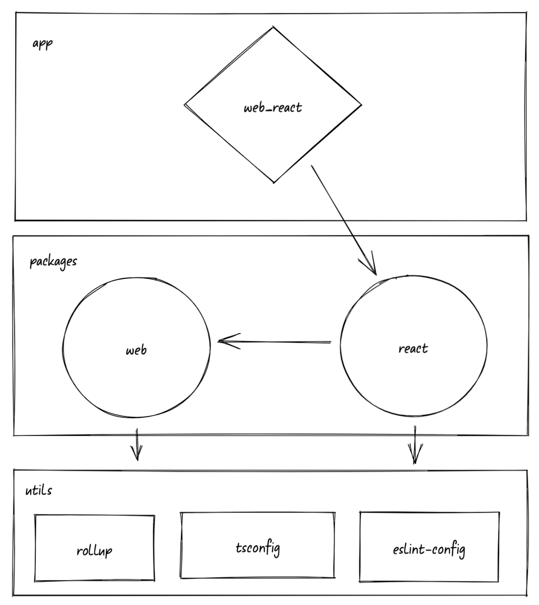
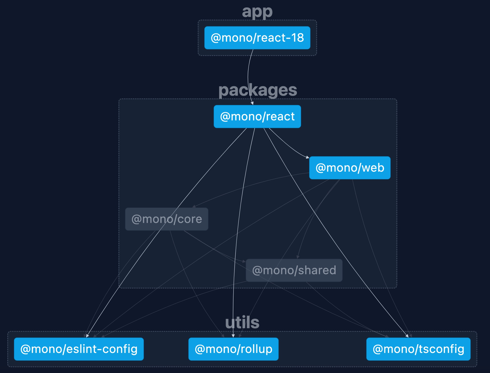

# overview
based on Pnpm + workspace,example for monorepo and the dependence graph as follows:

## install
requires at least Node 16.18.0 and Pnpm 7 to run
`pnpm i`

## build
build all of sub projects in parallel
`pnpm build`

## run web
`pnpm run web:dev`

## graph
run `nx graph`,you'll see graph like as follows:

